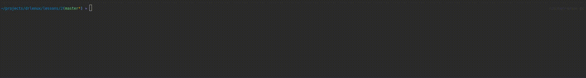

[](https://packagist.org/packages/drlenux/workers-run)
[](https://packagist.org/packages/drlenux/workers-run)
[](https://packagist.org/packages/drlenux/workers-run)


# EXAMPLE

`config.php`

```php
<?php

use Symfony\Component\Lock\Store\FlockStore;
use DrLenux\WorkersRun\messenger\FileDb;

return [
    'messenger' => [
        'lockStore' => FlockStore::class,
        'db' => [
            'class' => FileDb::class,
            'config' => [
                'type' => FileDb::FILE_TYPE_YAML,
                'file' => __DIR__ . '/mess.yaml'
            ]
        ]
    ]
];

```

`Work.php`

```php
<?php

namespace example;

use DrLenux\WorkersRun\Messenger;
use DrLenux\WorkersRun\IWork;
use DrLenux\WorkersRun\MessengerResponse;

/**
 * Class Work
 * @package example
 */
class Work implements IWork
{
    const U_SLEEP = 1000000;

    /**
     * @var float|int
     */
    private $time = 0;

    /**
     * @var string
     */
    private $message  = '';

    /**
     * Work constructor.
     * @param float $time
     * @param string $message
     */
    public function __construct(float $time, string $message)
    {
        $this->time = $time;
        $this->message = $message;
    }

    /**
     * @param Messenger $messenger
     * @return MessengerResponse|null
     */
    public function run(Messenger $messenger): ?MessengerResponse
    {
        usleep($this->time * self::U_SLEEP);
        return (new MessengerResponse(WorkMessageEcho::class, getmypid(), $this->message));
    }
}
```

`WorkMessageEcho.php`

```php
<?php

namespace example;

use DrLenux\WorkersRun\Messenger;
use DrLenux\WorkersRun\IWork;
use DrLenux\WorkersRun\MessengerResponse;

/**
 * Class WorkMessageEcho
 * @package example
 */
class WorkMessageEcho implements IWork
{
    /**
     * @param Messenger $messenger
     * @return MessengerResponse|null
     * @throws \Exception
     */
    public function run(Messenger $messenger): ?MessengerResponse
    {
        $count = 0;
        $maxCount = 5;
        while (true) {
            if ($count++ >= $maxCount) {
                break;
            }
            $res = $messenger->read(__CLASS__);
            if (count($res)) {
                foreach ($res as $item) {
                    /** @var MessengerResponse $item */
                    echo $item->getMessage();
                }
                $count = 0;
            }
            usleep(250000);
        }

        return null;
    }
}
```

`run.php`

```php
<?php

require __DIR__ . '/../vendor/autoload.php';

use DrLenux\WorkersRun\Works;
use example\{Work, WorkMessageEcho};
use DrLenux\WorkersRun\WorksRun;

$works = (new Works())
    ->add(new WorkMessageEcho())
    ->add(new Work(1, 'is '))
    ->add(new Work(0, 'Hi, '))
    ->add(new Work(0.7, 'what '))
    ->add(new Work(2, 'name?'))
    ->add(new Work(1.5, 'your '));

$config = require __DIR__ . '/config.php';

(new WorksRun($config))
    ->run($works)
    ->wait();


```

